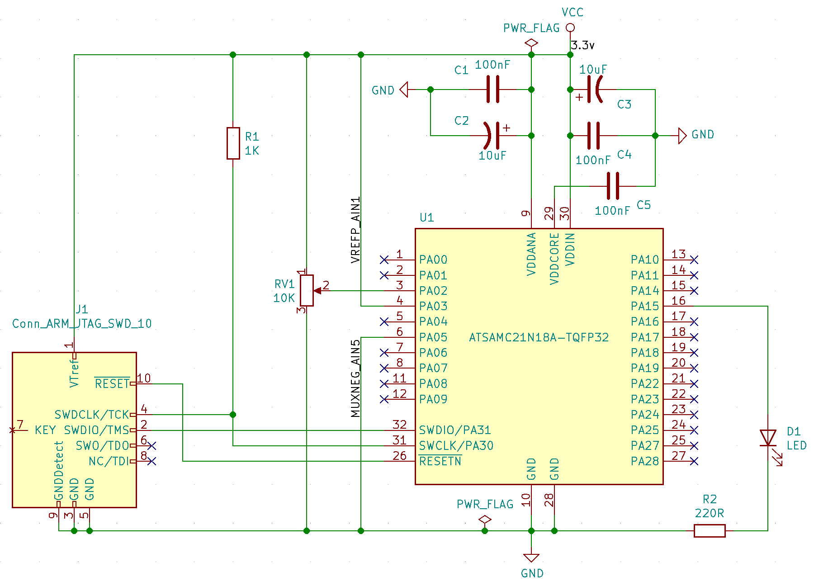

# Bare metal ARM MCU testing

A little project into getting a bare [32 pin, TQFP SAMC21E18A](http://www.microchip.com/mymicrochip/filehandler.aspx?ddocname=en598829) chip to do something.


## Prerequisites

Install the ARM embedded toolkit and openocd (`brew install homebrew/cask/gcc-arm-embedded openocd`).

Get an [Atmel-ICE programmer](https://www.digikey.com/short/z72v4z).


## Schematic



Connect the programmer to the breadboard


Power up the board.


## Compile and write flash

Figure out the serial number of the ICE programmer. On OSX look in "System Information -> USB"; on Linux use `lsusb`:

```
$ lsusb | grep Atmel
Bus 001 Device 004: ID 03eb:2141 Atmel Corp. ICE debugger
$ lsusb -v -s 001:004 | grep iSerial
  iSerial                 3 J42700008952
```

Write the serial number to `openocd.cfg`.

Compile:
```
$ cd gcc
gcc$ make
Building file: ../hal/src/hal_io.c
ARM/GNU C Compiler
"arm-none-eabi-gcc" -x c -mthumb -DDEBUG -Os -ffunction-sections -mlong-calls -g3 -Wall -c -std=gnu99 \
-D__SAMC21E18A__ -mcpu=cortex-m0plus  \
-I"../" -I"../config" -I"../examples" -I"../hal/include" -I"../hal/utils/include" -I"../hpl/adc" -I"../hpl/core" -I"../hpl/divas" -I"../hpl/dmac" -I"../hpl/gclk" -I"../hpl/mclk" -I"../hpl/osc32kctrl" -I"../hpl/oscctrl" -I"../hpl/pm" -I"../hpl/port" -I"../hpl/rtc" -I"../hpl/systick" -I"../hpl/tc" -I"../hpl/tsens" -I"../hri" -I"../" -I"../CMSIS/Core/Include" -I"../samc21/include" \
-MD -MP -MF "hal/src/hal_io.d" -MT"hal/src/hal_io.d" -MT"hal/src/hal_io.o"  -o "hal/src/hal_io.o" "../hal/src/hal_io.c"
Finished building: ../hal/src/hal_io.c

...

Finished building target: blinker.elf
"arm-none-eabi-objcopy" -O binary "blinker.elf" "blinker.bin"
"arm-none-eabi-objcopy" -O ihex -R .eeprom -R .fuse -R .lock -R .signature  \
        "blinker.elf" "blinker.hex"
"arm-none-eabi-objcopy" -j .eeprom --set-section-flags=.eeprom=alloc,load --change-section-lma \
        .eeprom=0 --no-change-warnings -O binary "blinker.elf" \
        "blinker.eep" || exit 0
"arm-none-eabi-objdump" -h -S "blinker.elf" > "blinker.lss"
"arm-none-eabi-size" "blinker.elf"
   text	   data	    bss	    dec	    hex	filename
   5552	     40	   8328	  13920	   3660	blinker.elf
$
```

and upload to the MCU:

```
gcc$ make program
Writing flash...
openocd -f ../openocd.cfg -c "program blinker.elf verify reset exit"
Open On-Chip Debugger 0.10.0
Licensed under GNU GPL v2
For bug reports, read
	http://openocd.org/doc/doxygen/bugs.html
none separate
adapter speed: 400 kHz
cortex_m reset_config sysresetreq
Info : CMSIS-DAP: SWD  Supported
Info : CMSIS-DAP: JTAG Supported
Info : CMSIS-DAP: Interface Initialised (SWD)
Info : CMSIS-DAP: FW Version = 01.00.0021
Info : SWCLK/TCK = 1 SWDIO/TMS = 1 TDI = 1 TDO = 1 nTRST = 0 nRESET = 1
Info : CMSIS-DAP: Interface ready
Info : clock speed 400 kHz
Info : SWD DPIDR 0x0bc11477
Info : at91samc21n18.cpu: hardware has 4 breakpoints, 2 watchpoints
target halted due to debug-request, current mode: Thread 
xPSR: 0x41000000 pc: 0x0000015c msp: 0x200020b0
** Programming Started **
auto erase enabled
Info : SAMD MCU: SAMC21E18A (256KB Flash, 32KB RAM)
wrote 16384 bytes from file blinker.elf in 2.059944s (7.767 KiB/s)
** Programming Finished **
** Verify Started **
verified 5592 bytes in 0.223037s (24.484 KiB/s)
** Verified OK **
** Resetting Target **
shutdown command invoked
$
```

The LED should start flashing.
